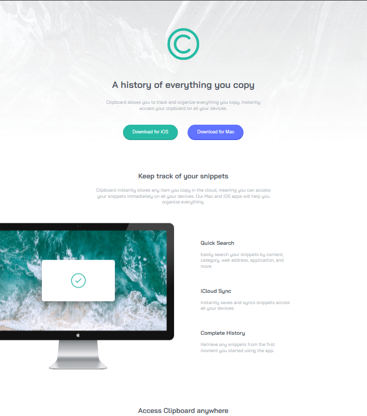
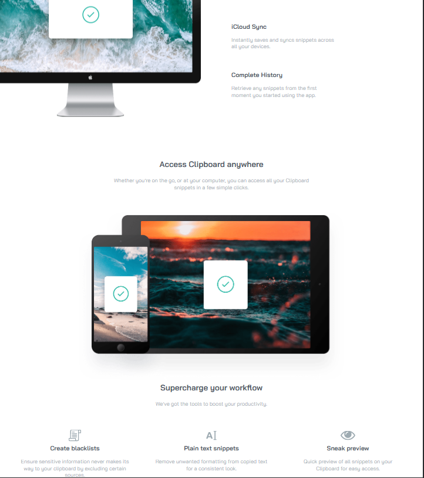
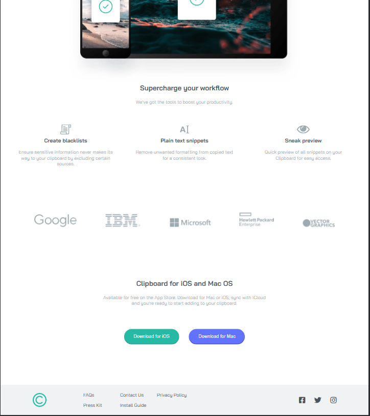
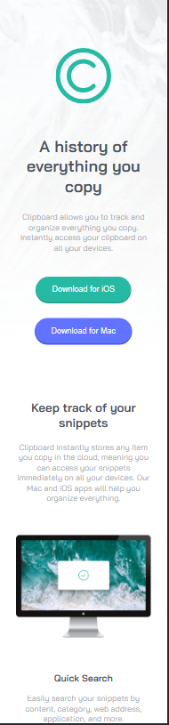
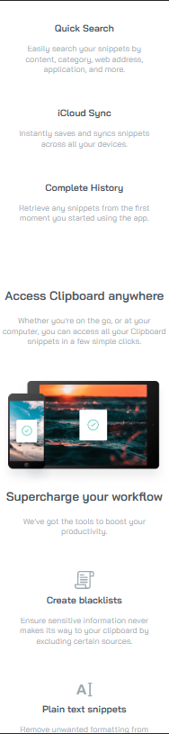
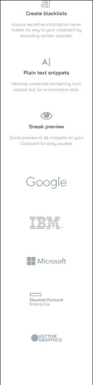
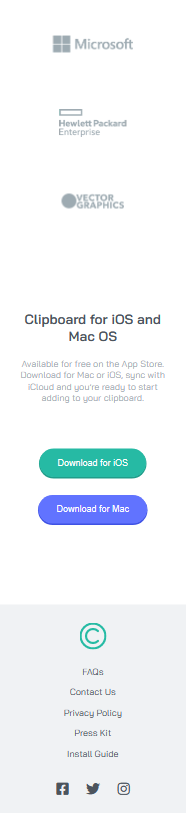

# Frontend Mentor - Stats preview card component solution

This is a solution to the [Stats preview card component challenge on Frontend Mentor](https://www.frontendmentor.io/challenges/stats-preview-card-component-8JqbgoU62). Frontend Mentor challenges help you improve your coding skills by building realistic projects.

## Table of contents

- [Overview](#overview)
  - [The challenge](#the-challenge)
  - [Screenshot](#screenshot)
  - [Links](#links)
- [My process](#my-process)
  - [Built with](#built-with)
  - [What I learned](#what-i-learned)
  - [Continued development](#continued-development)
  - [Useful resources](#useful-resources)
- [Author](#author)
- [Acknowledgments](#acknowledgments)

## Overview

### The challenge

Users should be able to:

- View the optimal layout depending on their device's screen size

### Screenshot

- Desktop version

&nbsp;
&nbsp;
&nbsp;

- Mobile version

&nbsp;&nbsp;
&nbsp;&nbsp;
&nbsp;&nbsp;

### Links

- Live Site URL: [[Live site at GitHub-Pages](https://viniciusmontibeller.github.io/fontend-mentor-clipboard-landing-page/)

## My process

### Built with

- Semantic HTML5 markup
- CSS custom properties
- Flexbox
- CSS Grid

### What I learned

In this project i learned the importance of good class names, that media queries should be use to add complexity and lastly on a big project organization and clean code should play a big part in it.

### Continued development

With this project i wnat to go deeper in responsive design, grid, and how to make my code cleaner

## Useful resources

 - [W3Schools](https://www.w3schools.com/)
 - [MDN Web Docs](https://developer.mozilla.org/en-US/)
 - [Dev em Dobro](https://github.com/devemdobro)

## Autor
 - Github - [viniciusmontibeller](https://github.com/viniciusmontibeller)
 - Frontend Mentor - [@viniciusmontibeller](https://www.frontendmentor.io/profile/viniciusmontibeller)

 ## Acknowledgments

I got to say that i'm really happy to be studying with the lessons by [Dev em Dobro](https://github.com/devemdobro). I started with zero programing skills and now i can see that i'm growing little by little into what i wanted to be.